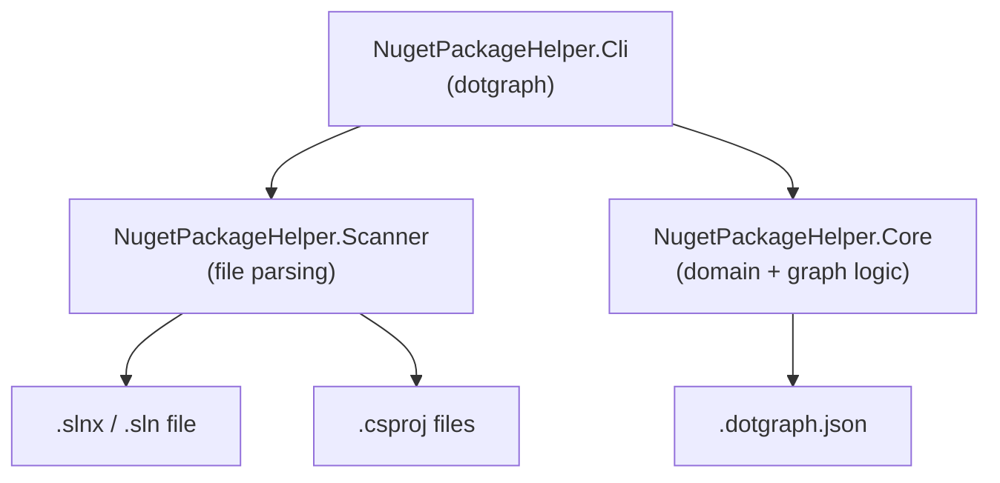
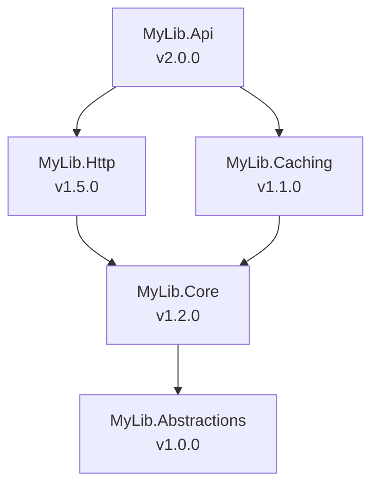
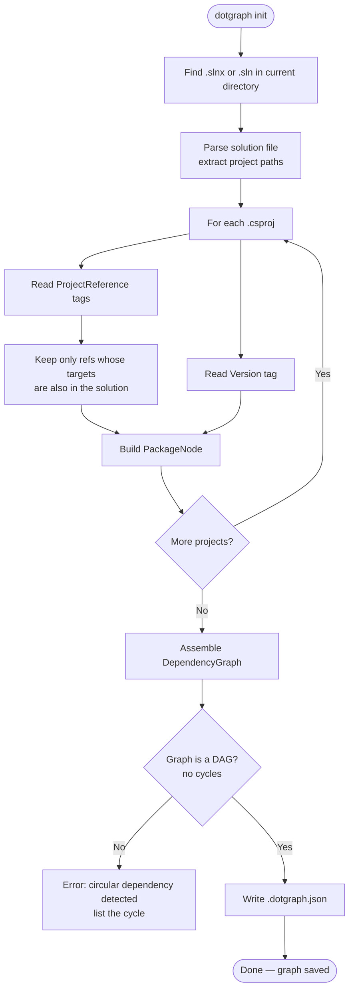
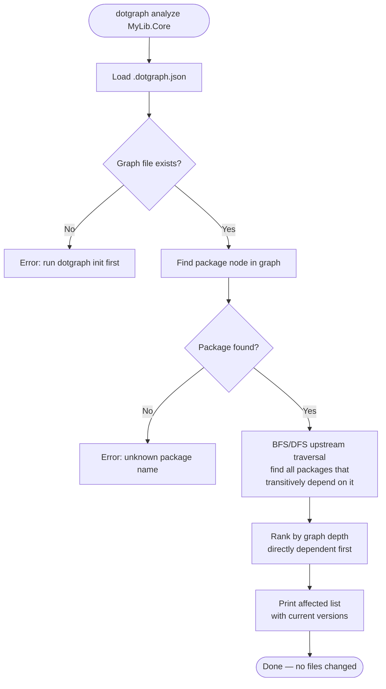
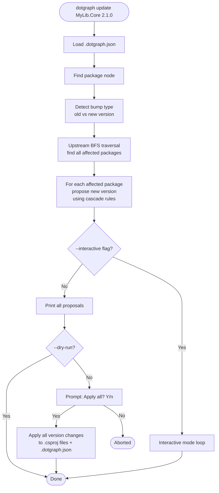
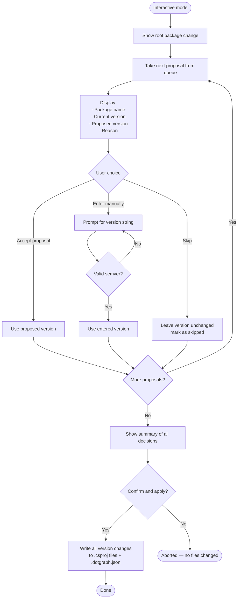
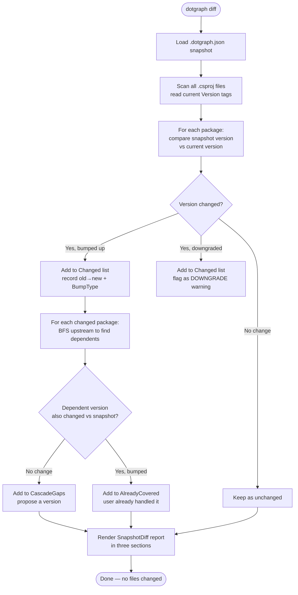
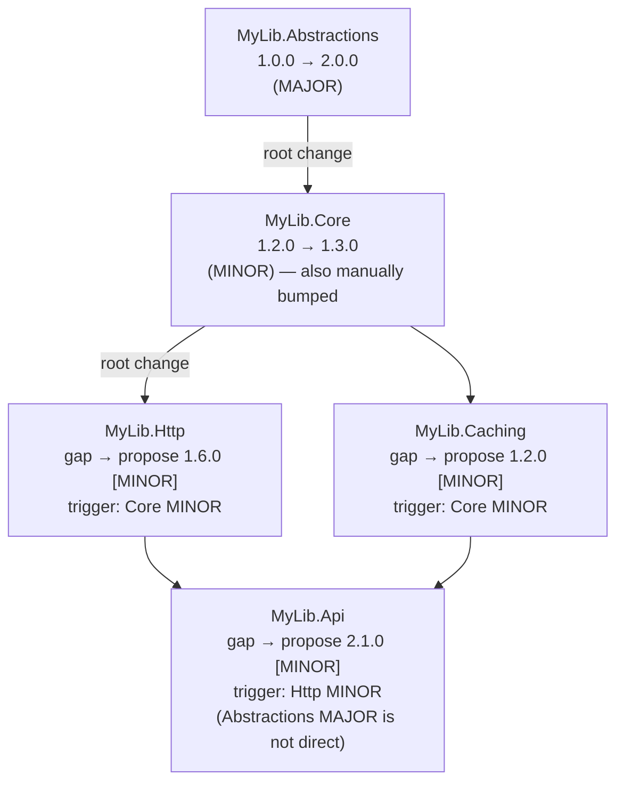
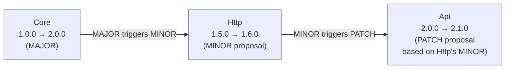
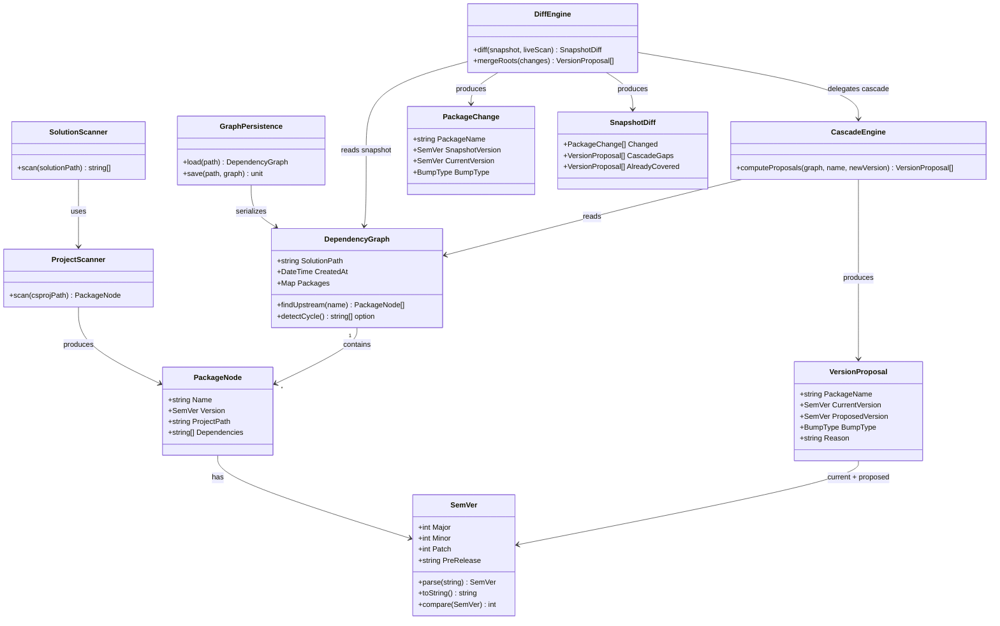

# dotgraph — Software Design Document

## 1. Goals

**Primary goal**: Given a .NET solution where multiple projects are published as NuGet packages and reference each other via `<ProjectReference>`, automatically detect which packages need version bumps when one or more packages change, and apply those bumps safely.

**Non-goals**:
- Managing external/third-party package updates (e.g., `Newtonsoft.Json`)
- Querying NuGet.org or any remote feed
- Publishing packages (only manages versioning)
- Supporting `packages.config` or `Directory.Packages.props`

---

## 2. Architecture Overview



### Component responsibilities

| Component | Responsibility |
|---|---|
| `NugetPackageHelper.Core` | Domain types, SemVer parsing/comparison, graph data structure, BFS/DFS traversal, version proposal logic |
| `NugetPackageHelper.Scanner` | Parsing `.slnx`/`.sln` to enumerate projects; parsing `.csproj` to extract `<Version>` and `<ProjectReference>` elements |
| `NugetPackageHelper.Cli` | CLI argument parsing, command dispatch, output formatting, interactive mode (Spectre.Console) |

---

## 3. Core Domain Types

```fsharp
// Semantic version
type SemVer = {
    Major: int
    Minor: int
    Patch: int
    PreRelease: string option
}

// How much a version changed
type BumpType = Major | Minor | Patch

// A single node in the dependency graph
type PackageNode = {
    Name: string          // Project/assembly name (matches NuGet package id)
    Version: SemVer
    ProjectPath: string   // Absolute path to .csproj
    Dependencies: string list  // Names of packages this project references via ProjectReference
}

// The full graph snapshot
type DependencyGraph = {
    SolutionPath: string
    CreatedAt: System.DateTime
    Packages: Map<string, PackageNode>
}

// A proposed version change for a dependent package
type VersionProposal = {
    PackageName: string
    CurrentVersion: SemVer
    ProposedVersion: SemVer
    BumpType: BumpType
    Reason: string        // Human-readable: "depends on MyLib.Core (MAJOR bump)"
}

// Result of an analyze or update operation
type CascadeResult = {
    Root: PackageName * SemVer * SemVer  // (name, old, new)
    Proposals: VersionProposal list       // ordered by graph depth (leaves first)
}

// A version change detected by comparing snapshot to live .csproj
type PackageChange = {
    PackageName: string
    SnapshotVersion: SemVer   // version stored in .dotgraph.json
    CurrentVersion: SemVer    // version found in .csproj right now
    BumpType: BumpType
}

// Full diff between snapshot and current filesystem state
type SnapshotDiff = {
    Changed: PackageChange list         // packages where csproj version ≠ snapshot version
    CascadeGaps: VersionProposal list   // dependents that need a bump but haven't been bumped yet
    AlreadyCovered: VersionProposal list // dependents already bumped by the user manually
}
```

---

## 4. Dependency Graph

The graph is a **directed acyclic graph (DAG)**:

- **Node**: a project in the solution that is published as a NuGet package
- **Edge A → B**: project A has `<ProjectReference>` to project B, meaning A *depends on* B



When a node's version changes, all nodes that **transitively depend on it** (reachable by following edges in reverse — upstream traversal) may need version bumps.

---

## 5. Application Flows

### 5.1 `dotgraph init`



### 5.2 `dotgraph analyze <pkg>`



### 5.3 `dotgraph update <pkg> <version>`



### 5.4 Interactive Mode



### 5.5 `dotgraph diff` — Auto-detect Changes

Compares the live `.csproj` versions against the `.dotgraph.json` snapshot to show exactly what changed and what cascade bumps are still missing. **Read-only — no files are written.**



**Output format** (`dotgraph diff`):

```
Changed packages (vs snapshot):
  MyLib.Core      1.2.0 → 2.0.0   [MAJOR]
  MyLib.Caching   1.1.0 → 1.2.0   [MINOR]  ← also manually bumped

Cascade gaps (need version bumps):
  MyLib.Http      1.5.0   → propose 1.6.0   [MINOR]  depends on MyLib.Core (MAJOR)
  MyLib.Api       2.0.0   → propose 2.1.0   [MINOR]  depends on MyLib.Http

Already covered (manually bumped, no action needed):
  MyLib.Caching   1.1.0 → 1.2.0   [MINOR]  depends on MyLib.Core (MAJOR) ✓

Run 'dotgraph sync' to apply the proposed cascade bumps.
```

---

### 5.6 `dotgraph sync` — Auto-detect and Apply Cascade

Runs the same diff as `dotgraph diff`, then proposes and applies version bumps for all cascade gaps. Accepts `--dry-run` and `--interactive` flags with the same semantics as `dotgraph update`.

```mermaid
flowchart TD
    Start([dotgraph sync]) --> Diff[Run snapshot diff\nsame as dotgraph diff logic]

    Diff --> AnyChanged{Any changed\npackages found?}
    AnyChanged -- No --> NothingToDo([Nothing to do.\nAll versions match snapshot.\nConsider running dotgraph refresh\nif you added new projects.])

    AnyChanged -- Yes --> AnyGaps{Any cascade\ngaps?}
    AnyGaps -- No --> NoGaps([All dependents already bumped.\nRun dotgraph refresh to update snapshot.])

    AnyGaps -- Yes --> Mode{--interactive?}

    Mode -- No --> PrintAll[Print diff report\n+ all proposals]
    PrintAll --> DryRun{--dry-run?}
    DryRun -- Yes --> Done([Done — no files changed])
    DryRun -- No --> AskConfirm[Prompt: Apply N version changes? Y/n]
    AskConfirm -- Yes --> ApplyAll[Write all proposed versions\nto .csproj files\nUpdate .dotgraph.json]
    AskConfirm -- No --> Abort([Aborted])

    Mode -- Yes --> Interactive[Interactive loop\nover all proposals\n(same as update --interactive)]
    Interactive --> Done([Done])
    ApplyAll --> Done
```

---

### 5.7 Multi-root Cascade (multiple packages changed simultaneously)

When `dotgraph diff` / `dotgraph sync` detects that **several packages** changed in one batch, their affected sets are merged before proposing versions. The trigger bump for each dependent is the **largest** bump type among all its changed direct or transitive dependencies.



Resolution rules when a dependent has **multiple changed ancestors**:
1. Collect the bump type from each direct dependency that changed (or whose proposal is known).
2. Take the **maximum** — `Major > Minor > Patch`.
3. Apply the cascade proposal rule for that maximum bump type.

This ensures a dependent never receives a weaker-than-needed version bump when it sits below multiple roots.

---

## 6. Version Cascade Rules

### Bump type detection

Given old version `a.b.c` and new version `x.y.z`:

| Condition | Detected bump |
|---|---|
| `x > a` | MAJOR |
| `x == a` and `y > b` | MINOR |
| `x == a` and `y == b` and `z > c` | PATCH |

### Cascade proposal table

| Parent bump | Proposed bump for each dependent |
|---|---|
| MAJOR | MINOR (bump minor, reset patch to 0) |
| MINOR | PATCH (bump patch only) |
| PATCH | PATCH (bump patch only) |

**Rationale**: A dependent whose code hasn't changed only needs to re-publish with updated dependency references — a minor or patch bump communicates "no new functionality in this package itself".

### Transitive cascade

When computing proposals, the *trigger bump type* used for each dependent is the bump type of its **closest changed dependency** (the one with the largest bump). If A depends on B (MAJOR) and C (PATCH), A's trigger is MAJOR.



---

## 7. File Parsing

### Solution files

- `.slnx` (new XML format, Visual Studio 2022+): parse `<Project Path="..." />` elements
- `.sln` (classic format): parse `Project(...)` lines with regex

### `.csproj` parsing

Extract from each project file:

| Element | XPath / location |
|---|---|
| Package version | `<Project><PropertyGroup><Version>` |
| Project references | `<Project><ItemGroup><ProjectReference Include="..." />` |

The `Include` attribute on `<ProjectReference>` is a relative path — resolve it to an absolute path, then match against the set of known solution projects to build the edge list.

---

## 8. Error Handling

| Scenario | Behavior |
|---|---|
| `.dotgraph.json` not found | Print error with hint to run `dotgraph init` |
| Circular dependency detected during init | Print the cycle and exit with error |
| Package name not found in graph | Print fuzzy-matched suggestions |
| Downgrade attempted (new version < old) | Warn user, require `--force` flag to proceed |
| `.csproj` has no `<Version>` tag | Skip that project, warn user |
| Multiple `.slnx`/`.sln` files in directory | Require `--solution <path>` flag |
| `dotgraph diff` / `sync` — no changes detected | Print "all versions match snapshot" and hint to run `dotgraph refresh` if new projects were added |
| `dotgraph sync` — all dependents already covered | Print "no cascade gaps" and hint to run `dotgraph refresh` to save the new baseline |
| `dotgraph diff` — a package version decreased vs snapshot | Show as DOWNGRADE warning in the diff report; `sync` will not auto-propose a fix, requires explicit `dotgraph update --force` |

---

## 9. Module Dependency Diagram



---

## 10. Technology Choices

| Concern | Choice | Reason |
|---|---|---|
| Language | F# | Algebraic types suit domain modeling; pattern matching fits version/bump logic |
| CLI parsing | `System.CommandLine` | Official .NET library, composable, good subcommand support |
| Interactive TUI | `Spectre.Console` | Rich terminal output; prompt/selection components for interactive mode |
| JSON serialization | `System.Text.Json` | Built-in, no extra dependency |
| XML parsing | `System.Xml.Linq` (XDocument) | Clean F# interop for `.csproj` parsing |
| Testing | `xunit` + `FsUnit` | Standard .NET test stack with F#-friendly assertions |
